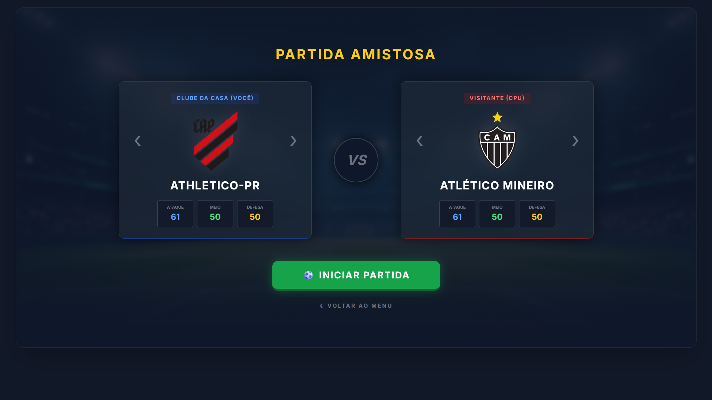
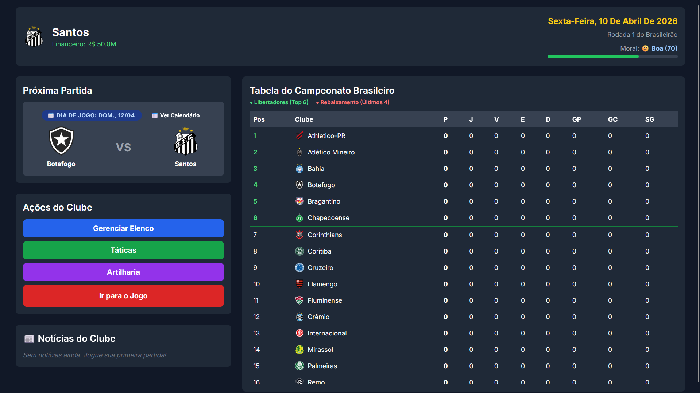

# ⚽ Prancheta - Simulador de Futebol

Bem-vindo ao **Prancheta** (anteriormente FMMeribe)! O seu simulador de futebol de navegador, focado em gerenciamento tático, simulação realista de atributos e gestão de elenco.

---

## 📸 Galeria do Jogo

  
### Menu Principal

### Amistoso

### Menu da Carreira

### Gerenciamento do Elenco

### Prancheta Tática

### Visão Pré-Jogo

### Artilheiros e Estatísticas

---

## 🚀 Novidades da Versão 0.2.0 (Atual)

A versão 0.2.0 traz sistemas fundamentais para a experiência de jogo, transformando o protótipo em uma base sólida para campanhas longas:

* **💾 Memory Card Profissional (Save/Load):** O jogo superou as limitações do navegador. Agora você pode exportar sua carreira (Tabela, Elenco, Finanças, Cansaço) em um arquivo físico `.json` e carregar quando quiser continuar jogando. Possui sistema de retrocompatibilidade para não quebrar saves antigos em atualizações futuras.
* **⚽ Modo Amistoso Rápido:** Uma tela de lobby dupla exclusiva para você testar táticas contra qualquer time da base de dados, com recuperação automática de *stamina* e sem afetar as estatísticas do seu Modo Carreira.
* **⚙️ Novo Motor de Configurações:**
    * **Dificuldade Dinâmica:** Opções de Inteligência da CPU (Amador com -10% de força, Profissional, e Lenda com +15% de buffs táticos).
    * **Controle de Tempo:** Altere a velocidade do relógio na simulação ao vivo (Rápida: 0.25s, Normal: 0.5s, Realista: 1.5s por minuto).
* **🎨 Redesign Visual:** O Menu Principal recebeu um banho de loja com estética de console, gradientes imersivos, carregamento de assets silencioso e a adoção do novo nome "Prancheta".

## 📦 Histórico de Versões (v0.1.0)

* **Inteligência Artificial "Funil Tático" (Engine):** O cérebro de escalação da CPU escala os times respeitando 4 fases rigorosas para evitar improvisações bizarras (Especialistas > Polivalentes > Setor > Desespero).
* **Cartas de Jogadores Profissionais:** Design compacto (125x82px) com nomes inteligentes (detectando sufixos como "Jr") e barra de *stamina* integrada visualmente na cartinha.
* **Interface Tática:** Prancheta *Drag and Drop* reformulada com posições no campo e lista de banco de reservas limitada.

## 🗃️ Banco de Dados de Clubes

O jogo carrega times diretamente de arquivos `.json` modulares. Atualmente implementados com elencos balanceados:
* 🟢 **Vasco da Gama** (São Januário)
* 🔴 **Flamengo** (Maracanã)
* 🟢 **Santos FC** (Vila Belmiro)
* 🔴 **S.C. Internacional** (Beira-Rio)
---
*Desenvolvido com Javascript Puro, TailwindCSS e muita paixão por tática.*