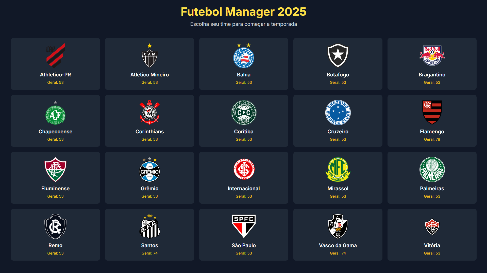
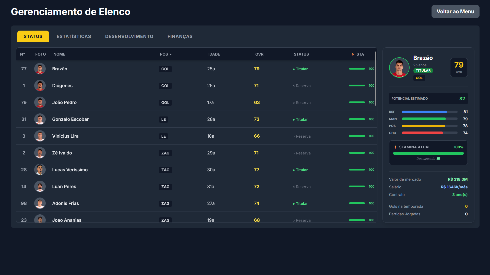
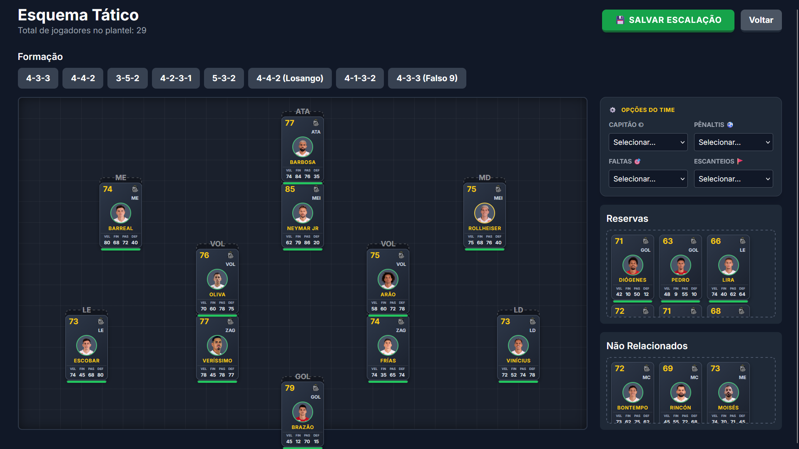
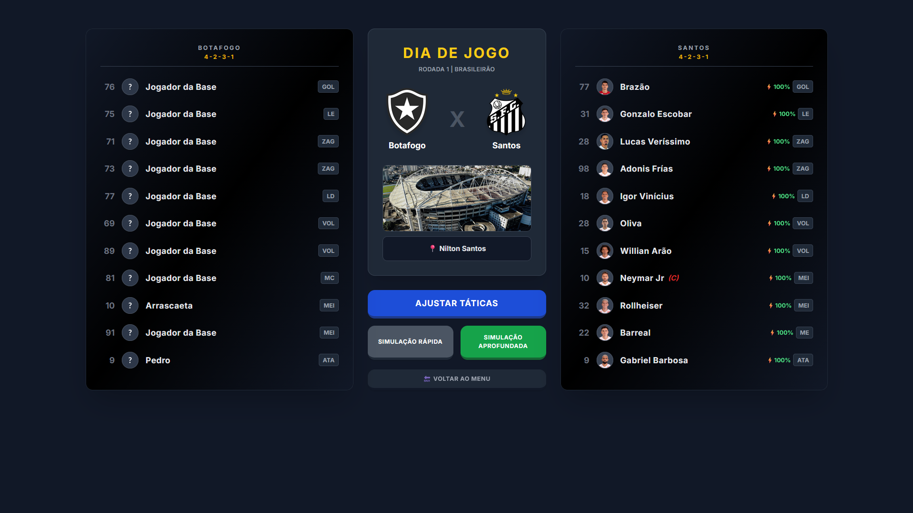
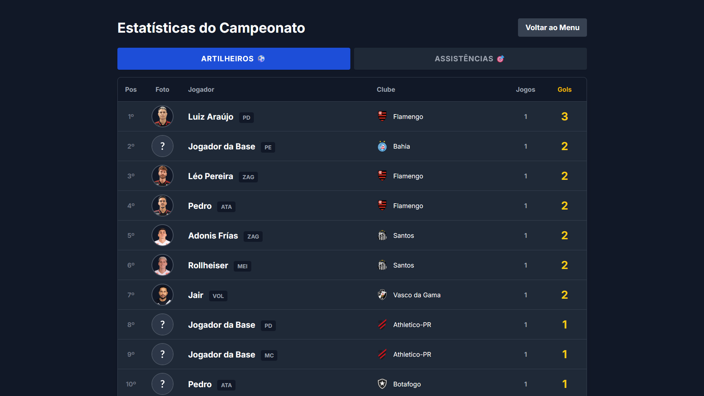

# ⚽ FMMeribe - Versão 0.1

Bem-vindo à mais nova grande atualização do projeto! Este patch foca em uma reformulação massiva do motor de inteligência artificial de escalações, otimização extrema do layout para monitores modernos e expansão do banco de dados de clubes.

## 📸 Galeria do Jogo

  
### Seleção de Times

### Menu Principal (Hub)

### Gerenciamento do Elenco

### Prancheta Tática

### Visão Pré-Jogo

### Artilheiros e Estatísticas

---

## 🚀 Novidades e Recursos Principais

* **Inteligência Artificial "Funil Tático" (Engine):** O cérebro de escalação da CPU foi reescrito. Agora a IA escala os times respeitando 4 fases rigorosas para evitar improvisações bizarras:
    1.  *Especialistas:* Busca jogadores com a posição primária exata.
    2.  *Polivalentes:* Busca jogadores com a posição secundária compatível.
    3.  *Setor:* Improvisa com jogadores do mesmo grupo (ex: zagueiro na lateral).
    4.  *Desespero:* Puxa o jogador de maior Overall disponível no banco.
* **Reformulação Visual do Hub Tático:** A tela de táticas foi redesenhada para aproveitar monitores em 100% de zoom (max-width de 1500px). 
    * Criação de uma barra lateral direita organizada abrigando as *Opções Avançadas* (Capitão e Batedores), *Reservas* e *Não Relacionados*.
* **Cartas de Jogadores (Player Cards) Profissionais:** * Novo tamanho compacto (125x82px) com matemática de espaçamento vertical de 20% para evitar sobreposição no campo.
    * **Nomes Inteligentes:** As cartas agora exibem de forma destacada (em amarelo e negrito) apenas o último nome do jogador, detectando automaticamente sufixos como "Jr" ou "Neto".
    * **Indicador de Fôlego:** Adicionada uma barra visual de Stamina diretamente nas cartas na aba de táticas e na listagem do pré-jogo.

## 🗃️ Banco de Dados

* **Clubes Adicionados:** * **Santos FC** adicionado com elenco completo, atributos personalizados e estádio (Vila Belmiro).

## 🐛 Correções de Bugs e Qualidade de Vida (QoL)

* **Fix do Scroll de Elenco:** Clicar em um jogador na lista longa agora salva a posição da barra de rolagem, impedindo que a tela "pule" de volta para o topo.
* **Fix de Layout (Flex-Wrap):** Jogadores com muitas posições secundárias não quebram mais as margens do painel de detalhes.
* **Fix de Escalação Dinâmica:** Mudar de formação agora preserva os 11 jogadores que já estavam em campo, apenas realocando-os para os novos slots disponíveis.
* **Botão de Fuga:** Adicionado botão de "Voltar ao Menu" na tela de simulação pré-jogo para evitar soft-locks.